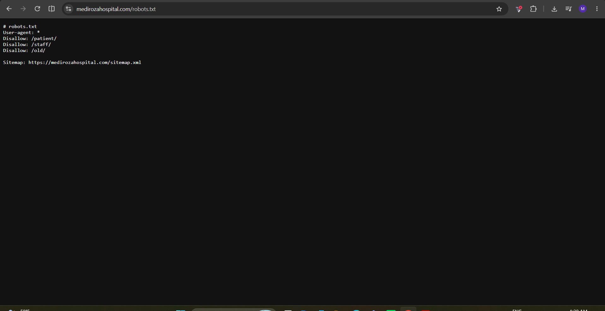
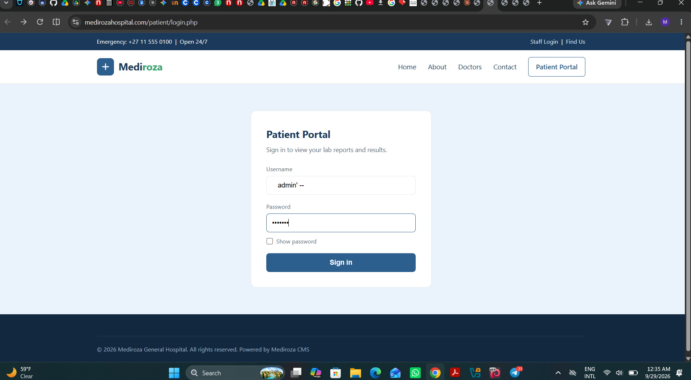
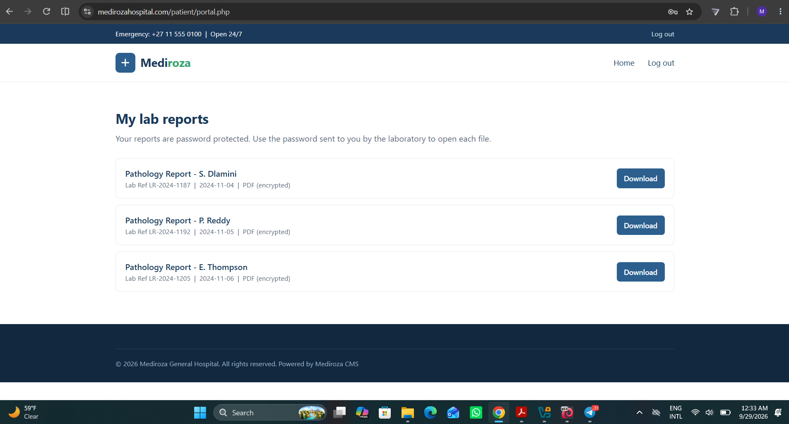

# M1 - Initial Access

**Goal:** Attack the website and find the 3 confidential PDF lab reports of patients.

---

## 🔍 Approach

1. Reviewed `robots.txt`, which disclosed disallowed (but unprotected) paths: `/patient/`, `/staff/`, `/old/`

2. Identified a patient portal login form at `/patient/login.php` this page is not listed in the site's public sitemap

3. Tested login form input handling by comparing error messages across different username/password combinations no differences found, ruling out username enumeration via error messages

4. Tested the login form for SQL injection

## 💥 Exploit

**Vulnerability:** SQL Injection - Authentication Bypass

- **Field:** Username
- **Payload:** `admin' -- `
- **Password:** any value ( test123 )

**Why it worked:** The login query was built by directly concatenating user input into a SQL statement. The single quote (`'`) closed the intended string early, and the trailing `-- ` comment marker caused the database to ignore the rest of the query, including the password check. The database only evaluated whether a user named `admin` existed no password validation occurred.

**Result:** Successfully bypassed authentication and gained access to the patient portal, which listed 3 confidential patient lab reports available for download.

## 📸 Evidence

**1. Recon - robots.txt disclosing hidden paths**

**2. SQL injection payload submitted on the login form**

**3. Portal accessed - 3 lab reports visible**

## 📄 Retrieved Files

- [`patient_report_1.pdf`](./patient_report_1.pdf) — password-protected (cracked in [M2-Data Extration](../M2/))
- [`patient_report_2.pdf`](./patient_report_2.pdf) — password-protected (cracked in [M2-Data Extraction](../M2/))
- [`patient_report_3.pdf`](./patient_report_3.pdf) — password-protected (cracked in [M2-Data Extration](../M2/))
