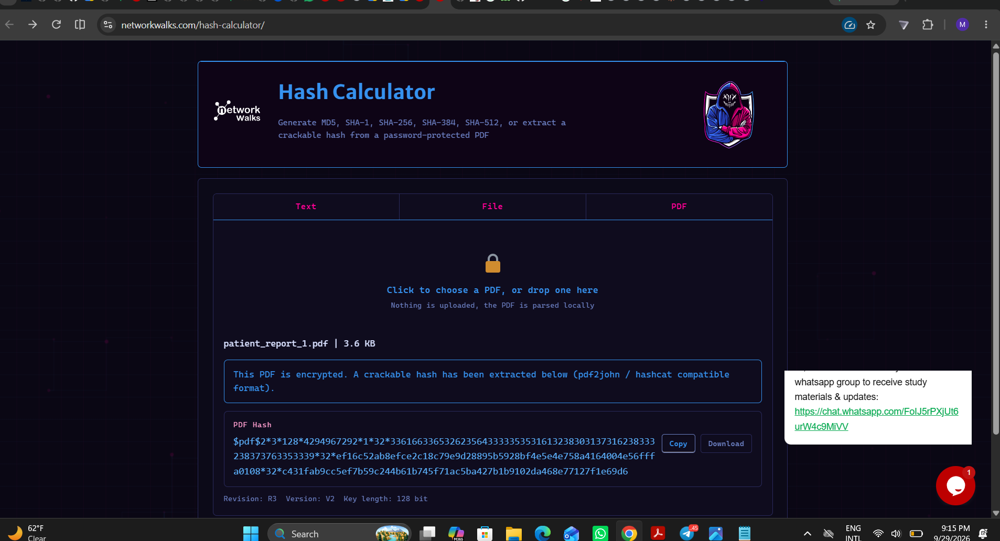
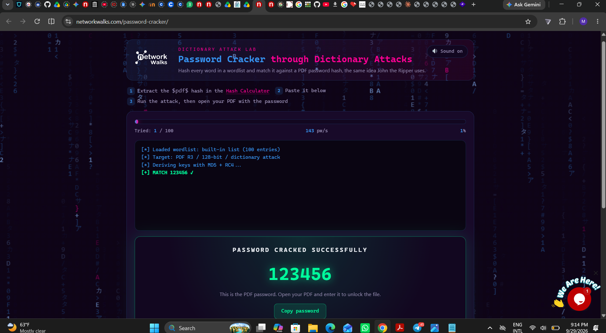
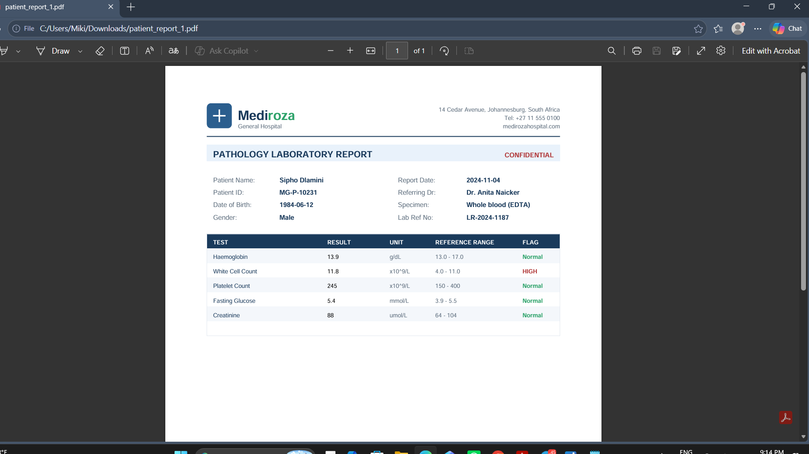
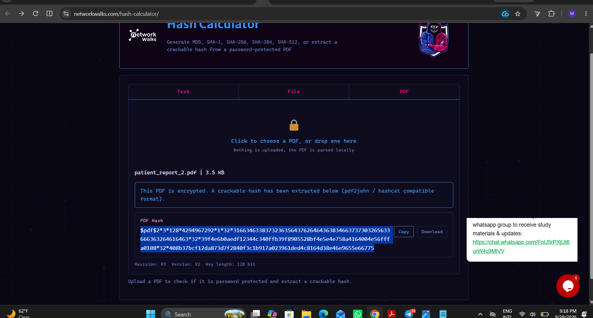
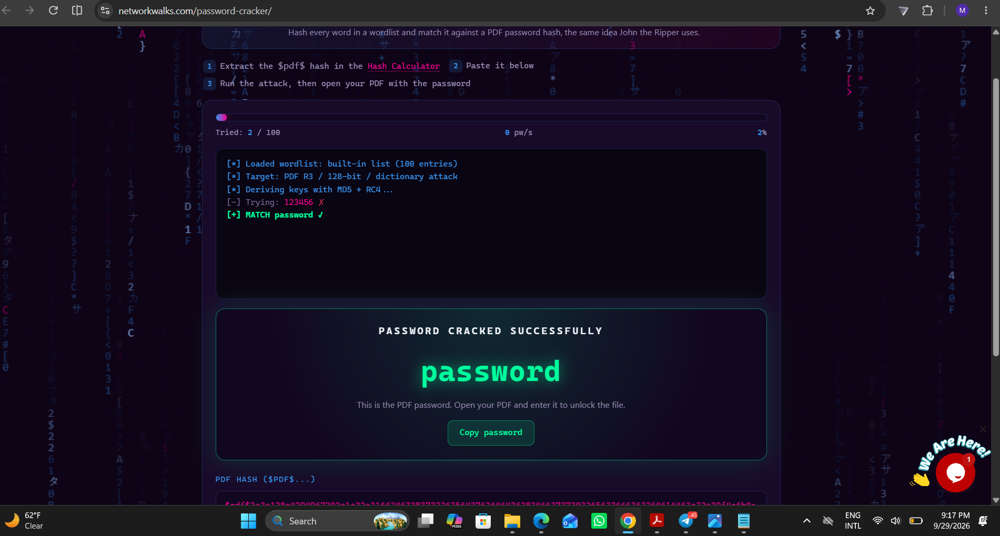
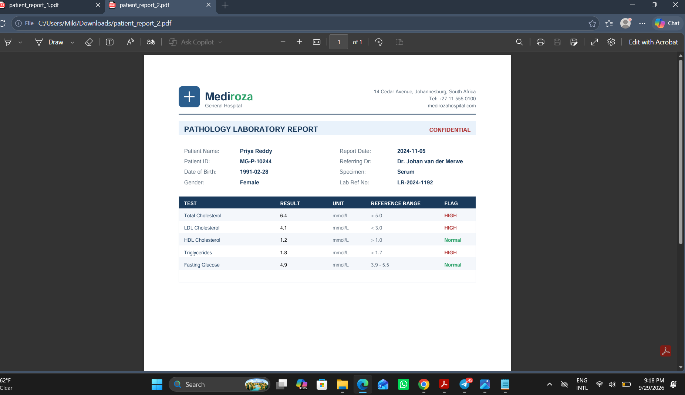
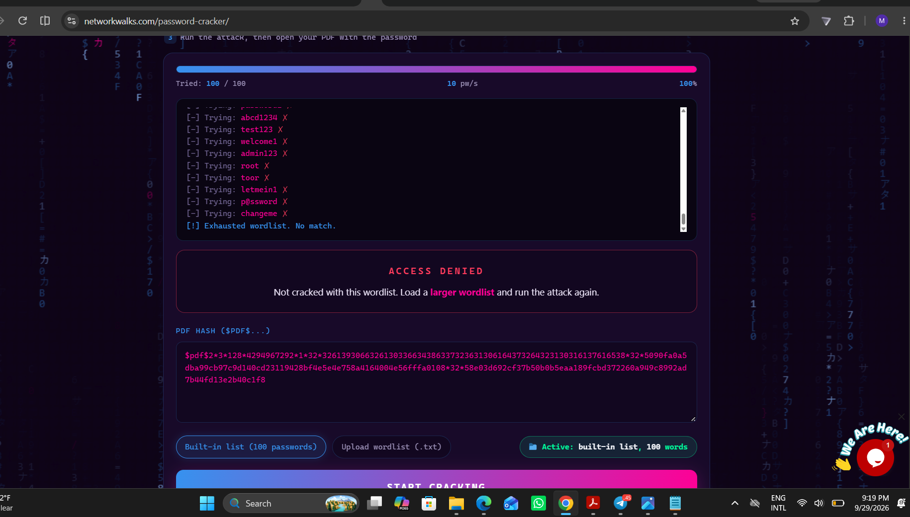
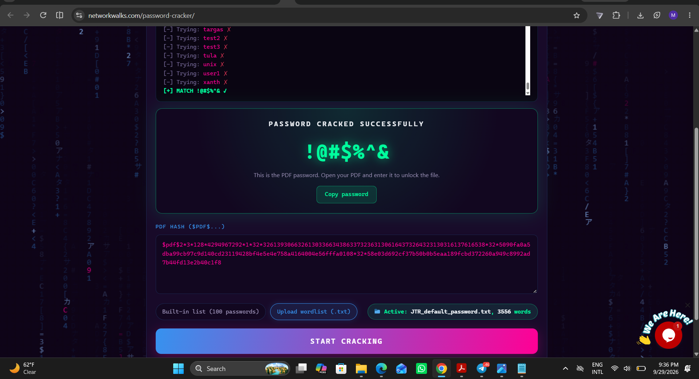
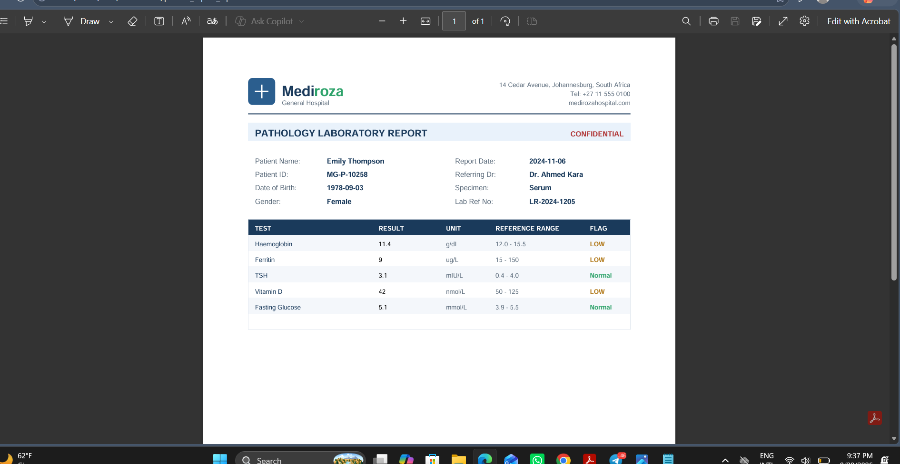

# M2 - Data Extraction

**Goal:** Crack the encryption on all 3 retrieved PDF files.

## 🔍 Approach

Each of the 3 patient lab reports retrieved in [M1-Initial Access](../M1/) was password-protected. For each file, the process was:

1. Extract a crackable hash from the PDF using the Networkwalks Hash Calculator

2. Run a dictionary attack against that hash using the Networkwalks Password Cracker

3. Open the decrypted PDF with the recovered password

---

## Record 1 - Sipho Dlamini (patient_report_1.pdf)

Extracted the PDF's hash using the Hash Calculator:

Ran the dictionary attack - cracked on the built-in wordlist:

**Password:** `123456`

Opened the decrypted report:

---

## Record 2 - Priya Reddy (patient_report_2.pdf)

Extracted the PDF's hash using the Hash Calculator:

Ran the dictionary attack - cracked on the built-in wordlist:

**Password:** `password`

Opened the decrypted report:

---

## Record 3 - Emily Thompson (patient_report_3.pdf)

Ran the dictionary attack with the built-in 100-word list - exhausted with no match:

Uploaded a larger custom wordlist (`JTR_default_password.txt`, 3,556 words) and re-ran the attack - match found:

**Password:** `!@#$%^&`

Opened the decrypted report:

---

## ✅Summary

| File | Password | Notes |
|---|---|---|
| patient_report_1.pdf | `123456` | Cracked on first attempt, built-in wordlist |
| patient_report_2.pdf | `password` | Cracked on first attempt, built-in wordlist |
| patient_report_3.pdf | `!@#$%^&` | Built-in wordlist insufficient; required an expanded custom wordlist |
