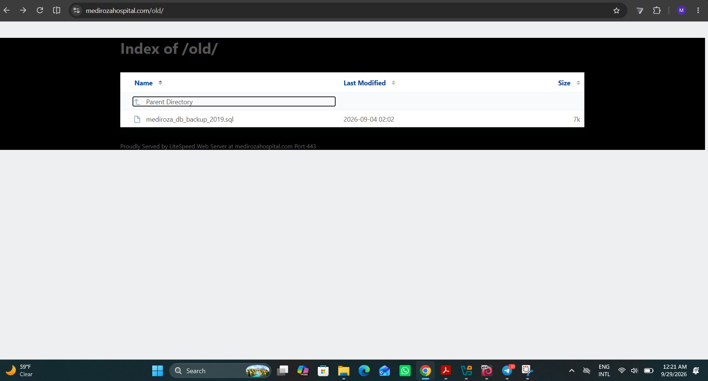
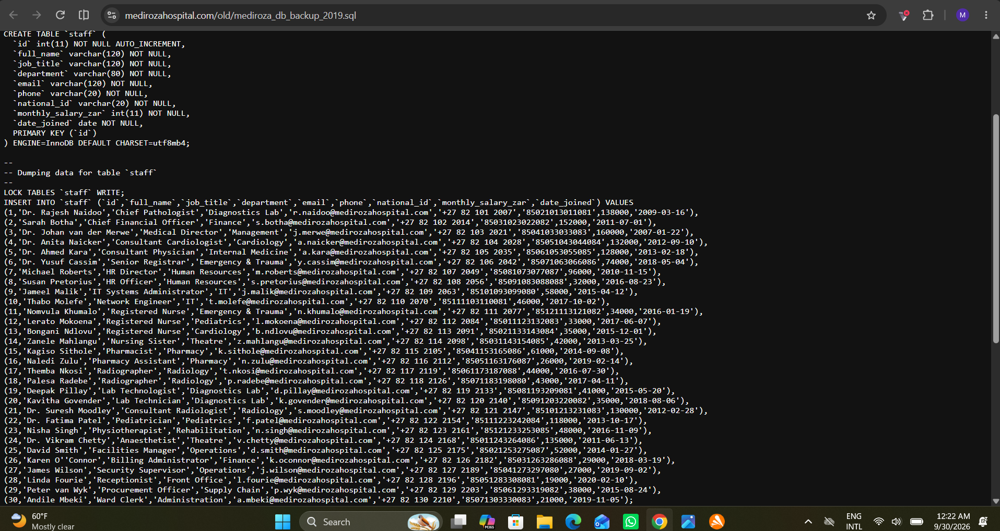
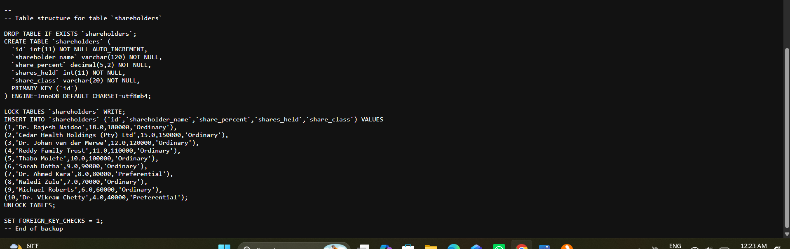
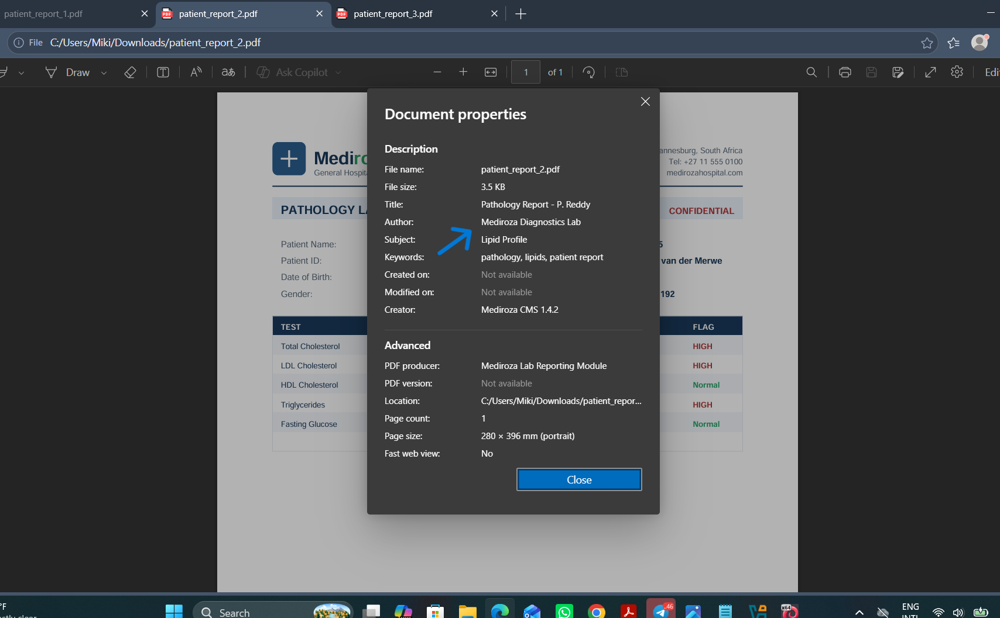
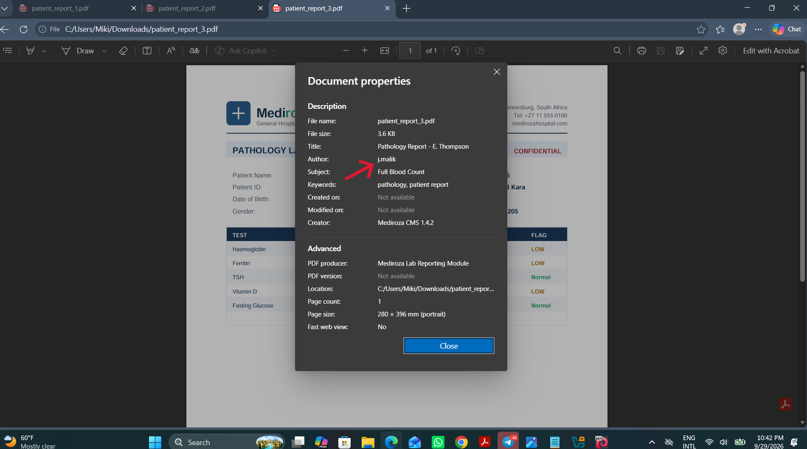

# M3 - Critical Data Exposure

**Goal:** Find the critical data exposure on the client server specifically, staff salaries and shareholder details.

## 🔍 Approach

`robots.txt` had already flagged `/old/` as a disallowed path (see [M1](../M1/)), but nothing actually enforced access control on it. It was just left out of search engine indexing. Visiting it directly revealed directory listing was enabled, exposing a file that should never have been publicly reachable.

A single file sat inside: `mediroza_db_backup_2019.sql` - a full, unprotected database backup, downloadable with no authentication at all.

---

## Exposed Data - Staff Salaries

The backup's `staff` table contained full personal and payroll records for all 30 hospital employees: names, job titles, departments, emails, phone numbers, **national ID numbers**, and monthly salaries.

This alone is a serious exposure - national ID numbers combined with full contact details create real identity theft risk for every employee at the hospital, not just a data privacy technicality.

---

## Exposed Data - Shareholder Details

The same backup also contained a `shareholders` table, listing every shareholder's name, ownership percentage, number of shares held, and share class effectively the hospital's confidential ownership structure.

---

## 🕵️ Bonus Finding - The "jmalik" Metadata Anomaly

While reviewing the 3 patient PDFs retrieved in [M1-Initial Access](../M1/) and decrypted in [M2-Data Extraction](../M2/), their document metadata was checked for anything unusual not part of the milestone's explicit task, but worth investigating on a hunch.

Two of the three reports had a normal, expected author: the hospital's own diagnostics system.

The third report, however, listed the author as **j.malik** not hospital reporting software at all.

Cross-referencing this against the leaked `staff` table confirmed the match: **Jameel Malik, IT Systems Administrator** (row `id = 9`).

### ⚠️ Why this matters

This is a real, standalone finding beyond just "we found some data":

- A confidential patient lab report was authored or handled through an **IT administrator's account**, not the hospital's clinical reporting system.
- This suggests either improper/unauthorized access to patient health records by IT staff, or that admin-level tools/credentials were used somewhere outside their intended clinical workflow.
- It points to a broader **access-control gap**  IT/technical staff appear able to touch confidential patient data (PHI) with no clear separation from clinical roles, which is a compliance and privacy problem on its own, independent of the SQL injection or the exposed backup.

This finding doesn't require any further exploitation to be significant it's a process/governance issue the hospital needs to investigate internally (who actually generated that file, and why).

---

## ✅ Summary

| Finding | Data Exposed |
|---|---|
| Exposed database backup (`/old/`) | Full staff PII + salaries, full shareholder ownership records |
| PDF metadata anomaly | Evidence of IT admin (jmalik) involvement in generating a patient record |
